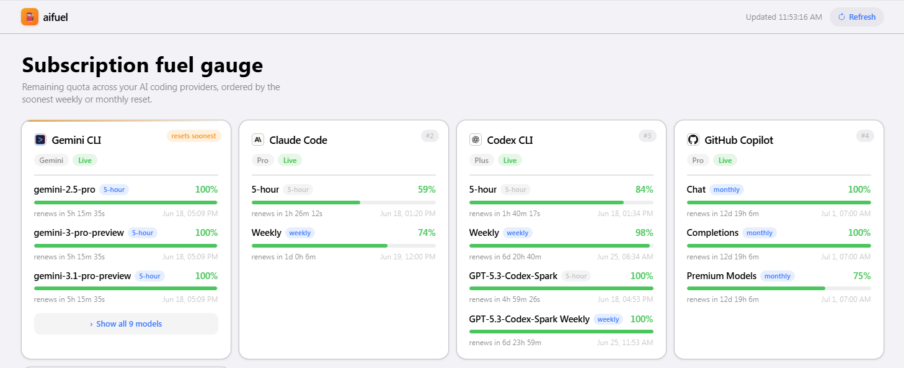

# ⛽ aifuel

**The fuel gauge for your AI coding subscriptions.**

You're paying for Claude Code, Codex, Copilot, Gemini, Antigravity… so which one runs out first? `aifuel` reads each provider's own usage endpoint and shows the **quota you have left** — in one dashboard, ranked by whichever weekly / monthly window **resets soonest**, with a live countdown to every refill.

Stdlib-only. No dependencies. Runs on **Windows, Linux, and macOS** — in your browser, your terminal, or as JSON.




---

## Why aifuel?

You can't manage a limit you can't see. Most quota trackers are **macOS menu-bar apps** (nothing for Windows/Linux) or **terminal-only CLIs you have to compile or `npm`/`cargo install`** first. `aifuel` is all three things at once:

- 🖥️ **Cross-platform *and* visual.** A real auto-refreshing dashboard on Windows, Linux **and** macOS — not just a Mac menu bar.
- 📦 **Zero-install.** A small, stdlib-only Python app. No `npm`, no `cargo build`, no app bundle, no virtualenv. `git clone` and run.
- ⏳ **Ranked by what runs out first.** Sorted by soonest reset, with a per-window countdown and renew date, so you see the cliff *before* you hit it mid-task.
- 🔋 **Shows what's *left*, not what you spent.** Remaining quota — not a cost/billing report.
- 🔒 **Local-only and honest.** Reads each CLI's own credentials to call that provider's usage endpoint, exactly like the CLI does. Nothing is printed, logged, or sent anywhere else.

## Quick start

```bash
git clone --depth=1 https://github.com/ducquoc97/aifuel.git
cd aifuel
python3 src/aifuel.py          # dashboard + browser at http://127.0.0.1:8787
python3 src/aifuel.py --no-browser   # serve without opening the browser
python3 src/aifuel.py --text   # compact colored terminal summary
python3 src/aifuel.py --json   # raw usage JSON, then exit
python3 src/aifuel.py --port 9000
```

The only thing you need is `python3`. That's the entire dependency list.

The CLI entrypoint lives at `src/aifuel.py`; provider handlers live under `src/aifuel/providers/`.

## Install as a global `aifuel` command

The installers drop a tiny `aifuel` launcher on your `PATH` that forwards to this repo's `aifuel.py`, so every flag passes straight through (`--json`, `--text`, `--no-browser`, …).

**Linux / macOS** (and Windows via WSL or Git Bash):

```bash
./scripts/install.sh                 # installs `aifuel` into ~/.local/bin
aifuel                               # dashboard at http://127.0.0.1:8787
aifuel --text                        # compact colored terminal summary
aifuel --json                        # raw usage JSON
./scripts/install.sh --uninstall     # remove it
```

Override the target dir with `BIN_DIR=/usr/local/bin ./scripts/install.sh`.

**Windows** (PowerShell):

```powershell
.\scripts\install.ps1                # installs aifuel.cmd into ~\.local\bin (+ adds it to PATH)
aifuel                               # dashboard (open a NEW terminal after install)
aifuel --json
.\scripts\install.ps1 -Uninstall     # remove it
```

Override the target dir with `.\scripts\install.ps1 -BinDir 'C:\tools\bin'`.

Both need only `python3` — no packaging, no dependencies. The launcher points back at the repo, so `git pull` updates `aifuel` too. (Don't move the repo, or re-run the installer after you do.)

## What it tracks

| Provider          | Source        | How                                                                 |
|-------------------|---------------|---------------------------------------------------------------------|
| Claude Code       | **live**      | `GET api.anthropic.com/api/oauth/usage` (token from `~/.claude/.credentials.json`); non-live responses are surfaced as errors |
| Codex CLI         | **live**      | `GET chatgpt.com/backend-api/codex/usage` (token from `~/.codex/auth.json`); non-live responses are surfaced as errors |
| GitHub Copilot    | **live**      | `api.github.com/copilot_internal/user` or `api.github.com/copilot_internal/v2/token` (token from `~/.copilot/config.json`, `~/.config/gh/hosts.yml`, or env); non-live responses are surfaced as errors |
| Gemini CLI        | **live**      | `:loadCodeAssist` → `:retrieveUserQuota` for real per-model bars (needs working OAuth and any required project); non-live responses are surfaced as errors |
| Antigravity CLI   | **live**      | Code Assist quota via its live OAuth token sources; non-live responses are surfaced as errors |

**Source legend:** `live` = pulled from the provider API. Any provider that cannot return live usage is shown as an error.

## Output modes

| Command | What you get |
|---|---|
| `aifuel` | Auto-refreshing **web dashboard** — cards, fuel bars, live countdowns |
| `aifuel --text` | Compact **colored terminal** summary (great over SSH) |
| `aifuel --json` | **Raw JSON** for scripts, status bars, and piping |

Because `--json` is a stable, structured feed, it drops cleanly into a tmux / polybar / Sketchybar / starship status line — pipe it and surface "what runs out first" wherever you already look.

## How it works (and what it touches)

- Credentials are read **locally only**, to authenticate each provider's own usage endpoint — exactly like the CLIs do. Tokens are never printed, and are only ever sent to the provider they belong to.
- For Gemini and Antigravity, an expired access token is refreshed against Google's OAuth endpoint using the `refresh_token` already on disk — the same exchange the CLI performs on startup — and written back to its own creds file.
- Claude's `oauth/usage` endpoint rate-limits aggressively, so results are cached for 180s.
- The dashboard auto-refreshes every 5 minutes; countdowns tick every second client-side.
- Ordering: each provider uses its authoritative weekly/monthly window when available; otherwise it uses the soonest reported reset. Providers are then ordered by that reset, with depleted providers last.

## FAQ

**Does this send my tokens anywhere?** No. It reads the same local credential files your CLIs already use, calls each provider's *own* usage endpoint, and shows you the result. There is no server, no telemetry, no third party.

**Do I need API keys?** No. It reuses the OAuth/login your CLIs already set up — if `claude`, `codex`, `gemini`, `gh`, or `agy` work on your machine, `aifuel` can read their quota.

**It only shows some providers.** It shows whatever it can authenticate. Log in to a provider's CLI (or set `GOOGLE_CLOUD_PROJECT` for paid Gemini tiers) and its card fills in.

**Why not just check each dashboard?** Because five tabs don't tell you which limit you'll hit first. `aifuel` does — at a glance, on every OS.
