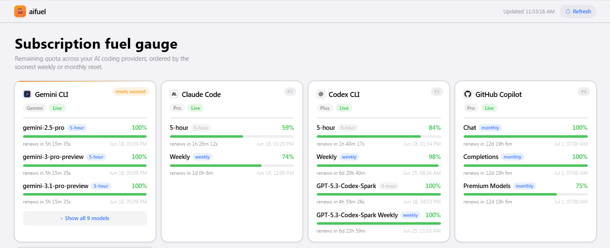

# ⛽ aifuel

**The fuel gauge for your AI coding subscriptions.**

You're paying for Claude Code, Codex, Copilot, Gemini, Antigravity... so which one runs out first? `aifuel` reads each provider's own usage endpoint and shows the **quota you have left** - in one dashboard, ranked by whichever weekly / monthly window **resets soonest**, with a live countdown to every refill.

One native binary. Runs on **Windows, Linux, and macOS** in your browser, terminal, or an MCP host.




---

## Why aifuel?

You can't manage a limit you can't see. `aifuel` combines a local
terminal summary, a browser dashboard, explicit provider execution, a
read-only MCP status server, and an MCP Gateway for external tools.

- 🖥️ **Cross-platform *and* visual.** A real auto-refreshing dashboard on Windows, Linux **and** macOS - not just a Mac menu bar.
- 📦 **Single binary.** Build once with Cargo, then run without Python, Node.js,
  or a virtual environment.
- ⏳ **Ranked by what runs out first.** Sorted by soonest reset, with a per-window countdown and renew date, so you see the cliff *before* you hit it mid-task.
- 🔋 **Shows what's *left*, not what you spent.** Remaining quota - not a cost/billing report.
- 🔒 **Local-only and honest.** Reads each CLI's own credentials to call that provider's usage endpoint, exactly like the CLI does. Nothing is printed, logged, or sent anywhere else.

## Quick start

```bash
git clone --depth=1 https://github.com/ducquoc97/aifuel.git
cd aifuel
cargo run -p aifuel -- --no-browser       # dashboard at http://127.0.0.1:8787
cargo run -p aifuel -- --text             # terminal quota summary
cargo run -p aifuel -- --json             # normalized status JSON
cargo run -p aifuel -- run --provider gemini --model gemini-2.5-flash --prompt "Explain Rust ownership"
cargo run -p aifuel -- mcp                 # read-only MCP server over stdio
```

For a reusable binary, run `cargo build --release -p aifuel` and use
`target/release/aifuel`.

## Rust CLI

The Cargo workspace contains the native application. The default command collects
live status for discovered provider integrations. `run` delegates one
explicit prompt to a selected installed provider CLI. `mcp` serves read-only
status over stdio, while `mcp gateway` serves selected external tools.

```bash
aifuel --text
aifuel --json
aifuel run --provider gemini --model gemini-2.5-flash --prompt "Explain Rust ownership"
aifuel mcp
```

Provider Discovery checks only provider-owned local source metadata. Collection
reads provider credentials to make read-only requests and never refreshes or
writes credentials.

Provider model defaults remain provider-owned. If a provider default is
temporarily rejected, select an explicit model with `--model` so
AI Fuel does not silently fall back to a different model.

The pinned provider catalog preserves all 69 provider IDs as explicit
capability states. The live Rust monitoring adapters currently cover Claude,
Codex, Copilot, Gemini, and Antigravity; catalog-only entries remain clearly
unsupported until an evidence-backed adapter is added.

## Install as a global `aifuel` command

The installers build the Rust binary and place it on your `PATH`.

**Linux / macOS** (and Windows via WSL or Git Bash):

```bash
./scripts/install.sh                 # installs `aifuel` into ~/.local/bin
aifuel                               # dashboard at http://127.0.0.1:8787
aifuel --text                        # compact colored terminal summary
aifuel --json                        # raw usage JSON
./scripts/install.sh --uninstall     # remove it
```

Override the target dir with `BIN_DIR=/usr/local/bin ./scripts/install.sh`.

**Windows** (PowerShell):

```powershell
.\scripts\install.ps1                # installs aifuel.exe into ~\.local\bin (+ adds it to PATH)
aifuel                               # dashboard (open a NEW terminal after install)
aifuel --json
.\scripts\install.ps1 -Uninstall     # remove it
```

Override the target dir with `.\scripts\install.ps1 -BinDir 'C:\tools\bin'`.

The installers require Rust and Cargo at install time. After installation,
the command has no separately installed language runtime requirement.

## MCP host setup

### AI Fuel read-only MCP Server

Configure an MCP host to start the local read-only server over stdio:

```json
{
  "mcpServers": {
    "aifuel": {
      "command": "aifuel",
      "args": ["mcp"]
    }
  }
}
```

The server exposes `get_status` and the `aifuel://status`
resource. It reports provider status, quota, freshness, provenance, and errors.
It does not execute prompts or edit files.

### AI Fuel MCP Gateway

The MCP Gateway exposes tools from one selected local stdio MCP server. You
provide the server executable and runtime; AI Fuel does not install it or run a
background daemon. It snapshots environment references when it starts and gives
the child only a small platform allowlist plus configured values. Explicit
values replace same-named inherited values, case-insensitively on Windows.
External tools keep their own behavior and may change data.

Save the central catalog as `aifuel/mcp.json` in your user config directory:

- Windows: `%APPDATA%/aifuel/mcp.json`
- macOS: `~/Library/Application Support/aifuel/mcp.json`
- Linux: `$XDG_CONFIG_HOME/aifuel/mcp.json`, or `~/.config/aifuel/mcp.json`

Select one existing local server for Codex:

```json
{
  "servers": {
    "local-docs": {
      "transport": "stdio",
      "command": "/absolute/path/to/mcp-server",
      "args": []
    }
  },
  "defaults": [],
  "agents": {
    "codex": { "servers": ["local-docs"] }
  }
}
```

Add this registration to `~/.codex/config.toml`:

```toml
[mcp_servers.aifuel-gateway]
command = "aifuel"
args = ["mcp", "gateway", "--agent", "codex"]
```

Restart Codex after saving the registration. The current gateway supports MCP
2025-11-25 tools over local stdio. It does not route resources or prompts,
remote Streamable HTTP, or task-based tool calls. The existing `aifuel mcp`
read-only status server remains separate.

## What it tracks

| Provider          | Source        | How                                                                 |
|-------------------|---------------|---------------------------------------------------------------------|
| Claude Code       | **live**      | `GET api.anthropic.com/api/oauth/usage` (token from `~/.claude/.credentials.json`); non-live responses are surfaced as errors |
| Codex CLI         | **live**      | `GET chatgpt.com/backend-api/codex/usage` (token from `~/.codex/auth.json`); non-live responses are surfaced as errors |
| GitHub Copilot    | **live**      | `api.github.com/copilot_internal/user` or `api.github.com/copilot_internal/v2/token` (token from `~/.copilot/config.json`); non-live responses are surfaced as errors |
| Gemini CLI        | **live**      | `:loadCodeAssist` → `:retrieveUserQuota` for real per-model bars (needs working OAuth and any required project); non-live responses are surfaced as errors |
| Antigravity CLI   | **live**      | Code Assist quota via its live OAuth token sources; non-live responses are surfaced as errors |

**Source legend:** `live` = pulled from the provider API. Any provider that cannot return live usage is shown as an error.

## Output modes

| Command | What you get |
|---|---|
| `aifuel` | Auto-refreshing **web dashboard** - cards, fuel bars, live countdowns |
| `aifuel --text` | Compact **colored terminal** summary (great over SSH) |
| `aifuel --json` | **Normalized JSON** for scripts, status bars, and piping |
| `aifuel run --provider ... --prompt ...` | Explicit prompt delegation to an installed provider CLI |
| `aifuel mcp` | Read-only MCP status server over stdio |
| `aifuel mcp gateway --agent codex` | Selected external tools through the AI Fuel MCP Gateway |

Because `--json` is a stable, structured feed, it drops cleanly into a tmux / polybar / Sketchybar / starship status line - pipe it and surface "what runs out first" wherever you already look.

## How it works (and what it touches)

- Credentials are read **locally only**, to authenticate each provider's own usage endpoint. Tokens are never printed, and are only ever sent to the provider they belong to.
- Before each collection, `aifuel` checks for each provider's own local credential source and initializes only the providers it finds. Discovery never calls an API, refreshes a token, or writes credentials.
- If a local discovery check fails, other providers still load. JSON reports the failure in `discovery_errors`, and one-shot commands return a nonzero exit status after printing available results.
- The Rust collection service never refreshes or writes provider credentials. Expired credentials are reported as unavailable.
- Provider status results are cached in-process for 300 seconds unless a refresh is requested.
- The dashboard auto-refreshes every 5 minutes; countdowns tick every second client-side.
- Ordering: each provider uses its authoritative weekly/monthly window when available; otherwise it uses the soonest reported reset. Providers are then ordered by that reset, with depleted providers last.

## FAQ

**Does this send my tokens anywhere?** No. It reads the same local credential files your CLIs already use, calls each provider's *own* usage endpoint, and shows you the result. There is no server, no telemetry, no third party.

**Do I need API keys?** No. It reuses the OAuth/login your AI coding CLIs already set up. A general GitHub CLI login does not count as a GitHub Copilot login.

**It only shows some providers.** It shows providers with their own local credential source. Log in to that provider's AI coding CLI, then refresh the dashboard.

**Why not just check each dashboard?** Because five tabs don't tell you which limit you'll hit first. `aifuel` does - at a glance, on every OS.
