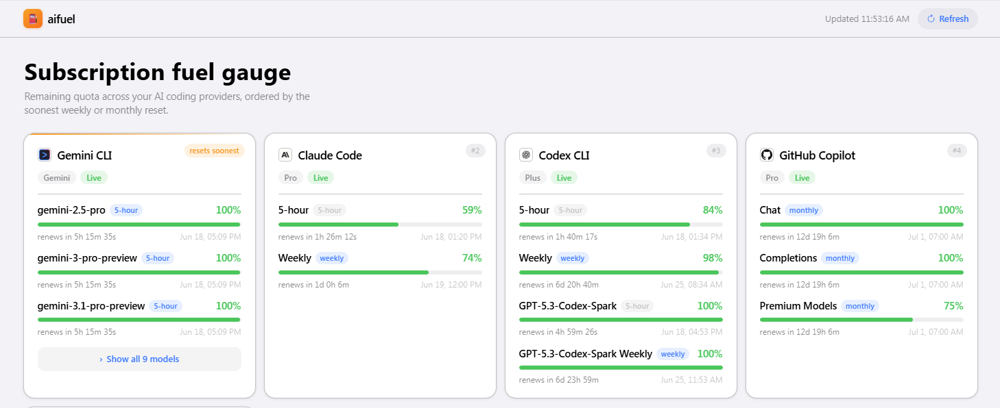

# ⛽ aifuel

**The fuel gauge for your AI coding subscriptions - and one interface for spending them.**

You pay for Claude Code, Codex, Copilot, Gemini, Antigravity, Devin... `aifuel` answers the two questions that matter: *which limit runs out first?* and *which subscription should take this prompt?*

- **Know what's left.** Reads each provider's own usage endpoint and shows the quota you have left in one dashboard, ranked by soonest reset, with a live countdown to every refill.
- **Spend it deliberately.** `aifuel run` sends a prompt through any installed provider CLI - explicit model and permission selection, resumable sessions, local approvals, `text|json|jsonl` output for scripts.
- **Wire it into your agents.** Three MCP servers expose quota status, run management, and a gateway that fronts your external MCP servers - so every host gets the same tools from one config.

One native binary. **Windows, Linux, macOS** - browser, terminal, or MCP host.




## Install

**Linux / macOS** (Windows via WSL or Git Bash):

```bash
./scripts/install.sh                 # installs `aifuel` into ~/.local/bin
./scripts/install.sh --uninstall     # remove it
```

**Windows** (PowerShell):

```powershell
.\scripts\install.ps1                # installs aifuel.exe into ~\.local\bin (+ PATH)
.\scripts\install.ps1 -Uninstall     # remove it
```

Override the target dir with `BIN_DIR=/usr/local/bin` (or `-BinDir` on Windows). The installers need Rust and Cargo; the installed command has no runtime requirement. Or build directly: `cargo build --release -p aifuel`.

## Commands

| Command | What you get |
|---|---|
| `aifuel` | **Web dashboard** at `http://127.0.0.1:8787` (opens a browser; optional auto-refresh) |
| `aifuel --no-browser` | Dashboard without opening a browser; `--host`/`--port` change the bind |
| `aifuel --text` | Compact **colored terminal** summary (great over SSH) |
| `aifuel --json` | **Normalized JSON** for scripts, status bars, and piping |
| `aifuel run --provider ID --prompt "..."` | One explicit prompt through an installed provider CLI |
| `aifuel run --provider auto --prompt "..."` | Route the prompt to the discovered provider with the most quota headroom |
| `aifuel profile list\|save\|remove` | Named defaults for `run` (provider, model, effort, access, timeout) |
| `aifuel model list\|refresh` | Cached provider model catalog, refreshed on demand |
| `aifuel auth list\|set-key\|remove` | Stored API keys for API-key integrations |
| `aifuel approve --run ID --input ID --decision accept\|decline\|cancel` | Answer a pending permission request for a local run |
| `aifuel mcp [--http [--host H] [--port P]]` | Read-only MCP status server over stdio, or streamable HTTP |
| `aifuel mcp execution [--http [--host H] [--port P]]` | MCP server that manages Agent Runs over stdio, or streamable HTTP |
| `aifuel mcp gateway --agent HOST [--tool T ...] [--http [--host H] [--port P]]` | Selected external MCP servers, served to one agent |
| `aifuel mcp setup --agent HOST [--dry-run] [--remove]` | Apply or remove the gateway entry in an agent's own config |
| `aifuel mcp servers ...` | Manage the gateway's external server catalog |
| `aifuel runtime` | JSON-RPC stdio bridge for embedding agent runs in a host process |

`--json` is a stable structured feed - it drops cleanly into a tmux / polybar / Sketchybar / starship status line.

## What it tracks

| Provider | Source | Reads credentials from |
|---|---|---|
| Claude Code | **live** | `~/.claude/.credentials.json` |
| Codex CLI | **live** | `~/.codex/auth.json` |
| GitHub Copilot | **live** | `~/.copilot/config.json` |
| Gemini CLI | **live** | Code Assist OAuth token |
| Antigravity CLI | **live** | Code Assist OAuth token |
| Devin CLI | **live** | `credentials.toml` key |

`live` = pulled from the provider's own API; a provider that cannot return live usage shows as an error, never a guess. API-key integrations for OpenRouter (`/key` credits), Z.AI (coding-plan quota windows), DeepSeek, and SiliconFlow (account balance) also report live when their key is set. A pinned catalog covers 75 provider IDs and flags documented free tiers (`has_free`/`free_note` in `--json`, `free:` in `aifuel auth list`) - catalog-only entries report as unsupported.

## Running prompts

```bash
aifuel run --provider codex --model gpt-5-codex --prompt "Explain Rust ownership"
```

Integration IDs (`--provider` is an alias for `--integration`): `claude`, `codex`, `copilot`, `gemini`, `antigravity`, `devin`, `opencode`, `cursor`, `ollama:local`, `lmstudio:local`, and the OpenAI-compatible API-key integrations `openai:api-key`, `openrouter:api-key`, `cerebras:api-key`, `cohere:api-key`, `deepinfra:api-key`, `deepseek:api-key`, `fireworks:api-key`, `groq:api-key`, `huggingface:api-key`, `mistral:api-key`, `moonshot:api-key`, `nvidia:api-key`, `perplexity:api-key`, `siliconflow:api-key`, `together:api-key`, `xai:api-key`, `zai:api-key`. Each `*:api-key` reads its provider's conventional env var (for example `GROQ_API_KEY`; Hugging Face uses `HF_TOKEN`) or a key stored with `aifuel auth set-key`. Options:

- `--prompt TEXT` / `--prompt-file PATH` - or omit both to pipe the prompt on stdin
- `--model ID` / `--effort LEVEL` - explicit model and effort
- `--profile NAME` - apply a saved profile (`aifuel profile save NAME --provider ID --model ID [--effort LEVEL] [--access MODE] [--timeout SECONDS]`)
- `--account ID` - explicit account
- `--access read-only|workspace-write|full` - permission profile (default: read-only)
- `--working-directory PATH` (or `--cwd`) - project directory for the run
- `--resume SESSION_ID` - continue a known session (`session_id` or `local_session_id` from a run's output); explicit `--model`/`--effort` override stored values
- `--external-tool NAME` - allow one exact gateway tool (repeatable)
- `--output text|json|jsonl` - result format (default: text)
- `--timeout 30s|10m|1h` - optional deadline; `0` means none

`--provider auto` is a reserved routing alias, never a literal provider id: `auto` ranks the discovered providers by the same quota evidence `aifuel status` shows (most remaining allowance first, soonest reset breaks ties), runs the prompt on the best one, and starts a new run on the next provider only when the previous attempt failed before execution - a missing integration, a launch/request error, or provider-reported quota exhaustion. A timeout or a mid-run failure ends the chain. `--model` narrows the candidates to providers whose cached catalog advertises that model, and `--resume` pins `auto` to the session's owning provider without fallback. The `json`/`jsonl` result carries a `routing` object listing the ranked candidates and every attempt's provider, outcome, and reason.

Exit codes: `0` succeeded, `2` request or launch error, `3` provider has no verified agent integration, `4` run failed, `5` timed out.

Permission requests are never auto-approved: a run that asks for one prints the pending request - answer it with `aifuel approve --run RUN_ID --input INPUT_ID --decision accept|decline|cancel`. Ordinary provider questions answer interactively during `aifuel run`, or through `answer_input` for runs owned by `aifuel mcp execution`.

## MCP

Three servers, each available over stdio (default) or streamable HTTP:

| Server | Purpose |
|---|---|
| `aifuel mcp` | Read-only status: `get_status` tool and `aifuel://status` resource |
| `aifuel mcp execution` | Owns Agent Runs: `list_agents`, `list_models`, `resolve_run`, `start_run`, `resume_session`, `answer_input`, `get_run`, `get_result`, `cancel_run`, `read_events` |
| `aifuel mcp gateway --agent HOST` | Serves your external MCP servers' tools, resources, and prompts to one agent |

Register the status server on any host over stdio:

```json
{ "mcpServers": { "aifuel": { "command": "aifuel", "args": ["mcp"] } } }
```

Permission approvals stay local-only through `aifuel approve` - the execution server cannot grant them.

### Streamable HTTP

Pass `--http` to any of the three servers to serve remote MCP Hosts over HTTP instead of stdio. The server listens on `/mcp` at `127.0.0.1:8788` by default; `--host` and `--port` override the bind address:

```bash
aifuel mcp --http                              # http://127.0.0.1:8788/mcp
aifuel mcp execution --http --port 8789        # a different port per server
aifuel mcp gateway --agent HOST --http --host 0.0.0.0 --port 8788
```

A remote host then registers the URL directly:

```json
{ "mcpServers": { "aifuel": { "url": "http://127.0.0.1:8788/mcp" } } }
```

Each HTTP session is a full MCP connection (session id via `MCP-Session-Id`, `GET /mcp` for server events, `DELETE /mcp` to end it), so the gateway's progress notifications and the execution server's per-connection run ownership behave exactly as over stdio. There is no authentication layer: binding anything beyond loopback exposes the server's full MCP surface on that interface, and doing so is the operator's responsibility. `aifuel mcp setup` still writes stdio entries into host configs; configure HTTP entries by URL instead.

### Gateway config

Servers are configured once in `aifuel/mcp.json` in your user config directory (`%APPDATA%/aifuel` on Windows, `~/Library/Application Support/aifuel` on macOS, `$XDG_CONFIG_HOME/aifuel` or `~/.config/aifuel` on Linux):

```json
{
  "servers": {
    "local-docs": { "transport": "stdio", "command": "/absolute/path/to/mcp-server", "args": [] },
    "remote-docs": { "transport": "streamable-http", "url": "https://mcp.deepwiki.com/mcp" }
  },
  "defaults": [],
  "agents": {
    "codex": { "servers": ["remote-docs"] }
  }
}
```

A host with no `agents` entry inherits `defaults`. Manage the catalog without editing JSON:

```bash
aifuel mcp servers list|validate
aifuel mcp servers add SERVER_ID --definition FILE | remove SERVER_ID
aifuel mcp servers select --defaults [SERVER_ID ...] | --agent HOST [SERVER_ID ...] | --agent HOST --inherit
```

Trust rules: remote endpoints must use HTTPS (plain HTTP only on loopback) and speak MCP 2025-11-25. `bearerTokenEnv` and `secretHeaders` name environment variables only - values resolve once at startup (a missing or empty value fails that server), are sent only to the configured endpoint, and are never written to `mcp.json` or logs. Redirects are rejected, so configure the final URL. For stdio servers, `env` sets literals and `envFrom` names variables read at startup; children get a small platform allowlist plus what you configure.

Then connect an agent: `aifuel mcp setup --agent HOST` writes the managed entry into the host's config (backup and `--dry-run` supported, `--remove` detaches). Host IDs: `codex`, `claude`, `copilot`, `gemini`, `antigravity`, `devin`. Restart the host after changing its registration. Repeatable `--tool NAME` on `mcp gateway` restricts which tools a host sees.

### Quota webhooks

Each collection (dashboard refresh, `--json`, `--text`, MCP `get_status`) can POST events to configured endpoints - useful for Slack, Discord, or any HTTPS receiver. Configure `webhooks.json` in the same `aifuel` user config directory as `mcp.json`:

```json
{
  "webhooks": [
    { "url": "https://hooks.slack.com/services/...", "events": ["threshold_crossed", "quota_reset"], "threshold_percent": 90 }
  ],
  "defaults": { "events": ["threshold_crossed", "quota_reset"], "threshold_percent": 90 }
}
```

`threshold_crossed` fires when a quota window's consumed share reaches `threshold_percent` (default 90); `quota_reset` fires when a window that was over threshold comes back under it - the window reset or quota was replenished. `events` and `threshold_percent` fall back to `defaults`, then to the built-ins. Payloads look like:

```json
{ "event": "threshold_crossed", "provider": "gemini", "provider_name": "Gemini CLI", "window": "gemini-3.5-flash", "window_period": "daily", "authoritative": true, "percent_used": 95.0, "percent_remaining": 5.0, "threshold_percent": 90, "reset_at": 1893456000.0, "checked_at": 1790879303.8 }
```

`reset_at` and `checked_at` are Unix seconds. Endpoints must use HTTPS, or HTTP only on loopback - the same trust rule as the MCP gateway. Each crossing notifies once per window and threshold; the state lives in `webhook-state.json` so restarts don't re-announce. Delivery is at-most-once with short timeouts, and failures are logged to stderr without affecting collection.

## How it works

- Credentials are read **locally only** - the same files your CLIs already use. Tokens are never printed and are sent only to their own provider's usage endpoint.
- Discovery is filesystem-only: it never calls an API, refreshes a token, or writes credentials. One provider's failure doesn't block the rest - JSON reports it in `discovery_errors`.
- Results cache in-process for 300s unless a refresh is requested; the dashboard's 5-minute auto-refresh is opt-in and countdowns tick every second.
- Providers rank by their authoritative weekly/monthly window, else soonest reset; depleted providers sort last.

## FAQ

**Does this send my tokens anywhere?** No. It reads the same local credential files your CLIs use, calls each provider's *own* usage endpoint, and shows the result. No server, no telemetry, no third party.

**Do I need API keys?** Not for monitoring - it reuses the OAuth/logins your AI coding CLIs already set up. `aifuel run` through an API-key integration (any `*:api-key` id listed above) does need one via `aifuel auth set-key` or the provider's env var. A general GitHub CLI login does not count as a GitHub Copilot login.

**It only shows some providers.** Those are the ones with local credentials. Log in to that provider's AI coding CLI, then refresh.

**Why not just check each dashboard?** Six tabs don't tell you which limit you'll hit first - `aifuel` does, at a glance.
